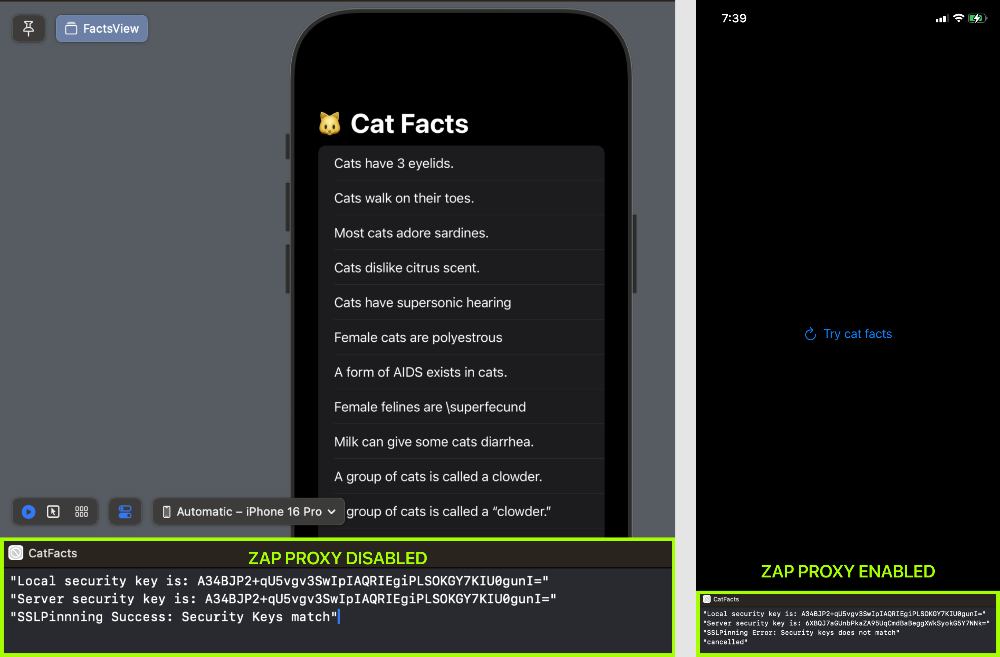
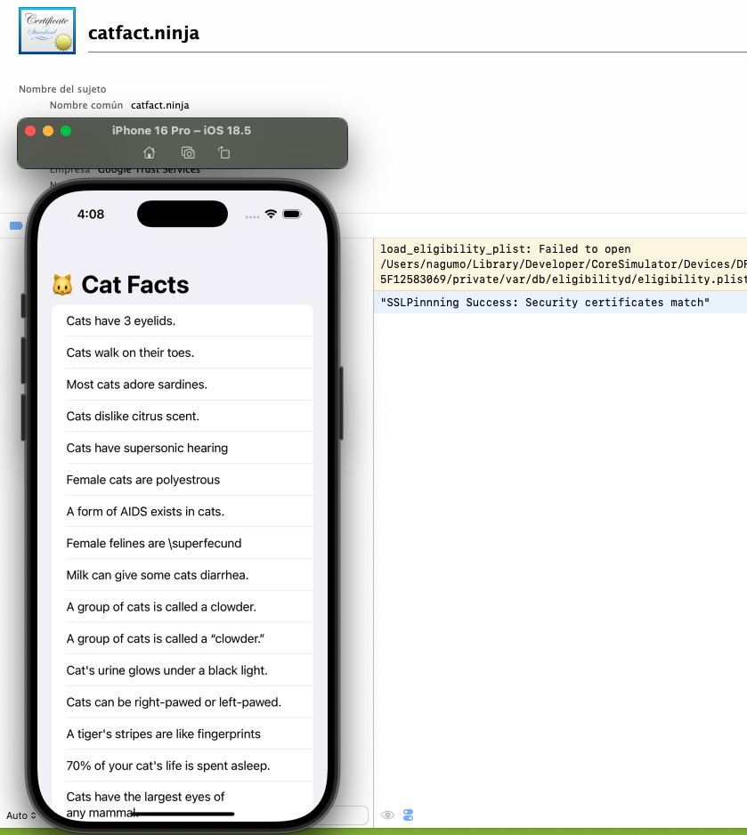

# cat_facts

* Its an **iOS** project.
* Implements the **Clean Architecture** using the **MVVM** design pattern in the Presentation layer.
* Uses **Async/Await** and Combine for network tasks.
* UI built with **SwiftUI**.
* Consumes the [Cat Facts API](https://catfact.ninja/) using a custom URLSession service to add a network security layer.
* Implements **SSL Pinning** to protect the communication of the app with the server and avoid **MITM** attacks or **proxy interceptions**. For both Public Key and Certificate.
* Uses **CryptoKit** to create a **SHA256** representation of security keys.
* Implement obfuscation and encriptation for publick key

## Screenshots
### SSL Public Key Success vs SSL Error 

### SSL Certificate Success 
