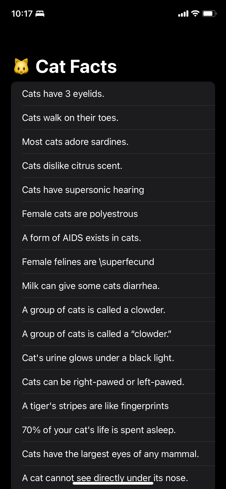

# cat_facts

* Its an **iOS** project
* Implements the **Clean Architecture** using the **MVVM** design pattern in the Presentation layer
* Uses **Async/Await** and Combine for network tasks
* UI built with **SwiftUI**
* Consumes the [Cat Facts API](https://catfact.ninja/)
* TODO: It is going to implement **network communication** security and **obfuscation**

## Screen
